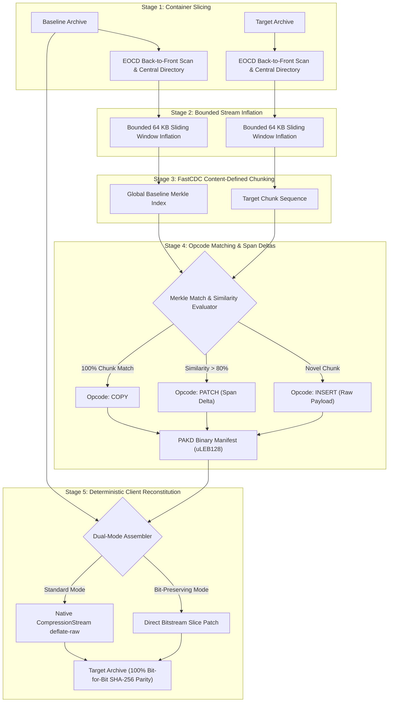

# pak-delta

<div align="center">

### Archive-Aware Content-Defined Delta Compression Engine for Game Packfiles and Container Archives

[](https://www.typescriptlang.org/)
[-2ea44f?style=flat-square&logo=vitest&logoColor=white)](#testing-and-chaos-engineering)
[](#core-engineering-invariants)
[](#3-streaming-bounded-memory-footprint)
[](#2-deterministic-byte-for-byte-parity)
[](https://mikev-lab.github.io/pak-delta/)
[](LICENSE)

<p align="center">
  <b>Eliminating the DEFLATE entropy cascade in binary game patching with zero runtime dependencies.</b>
</p>

[Overview](#overview) • [The Entropy Cascade](#the-entropy-cascade-problem) • [Comparative Benchmarks](#comparative-benchmarks) • [Pipeline Architecture](#pipeline-architecture) • [Quickstart](#developer-quickstart) • [Interactive Demo](#interactive-browser-test-harness) • [Documentation Hub](#public-documentation-hub)

</div>

---

## Overview

`pak-delta` is an archive-aware, content-defined delta compression engine designed specifically for compressed game packfiles and binary container archives:
- **Unreal Engine:** `.pak` files (including NVMe 4 KB / 64 KB DMA sector alignment padding)
- **Unity:** `.assetbundle` and archive containers
- **Android:** `.apk` packages
- **Standard Archives:** `.zip` and DEFLATE containers

Standard binary diff algorithms (such as `bsdiff`, `xdelta`, or `courgette`) operate on the outer compressed byte stream. When applied to compressed archives, internal DEFLATE/LZMA compression acts as an entropy cascade: **a 1-byte localized edit to a texture or audio asset scrambles 98.72% of the downstream compressed bytes**, forcing game clients to download gigabytes of redundant archive data for minor game updates.

`pak-delta` eliminates the entropy cascade by decoupling the container compression envelope from the underlying uncompressed asset streams. It applies Content-Defined Chunking (FastCDC) over uncompressed segments, matches chunks globally across the entire container, and reconstitutes target archives on client machines byte-for-byte, matching the official target SHA-256 hash down to the exact bit.

---

## The Entropy Cascade Problem

To quantify why traditional delta tools degrade on game packfiles, we conducted an empirical measurement on a 1 MB synthetic game texture asset with a single 1-byte edit at offset 50,000 (a 0.00010% uncompressed modification):

| Metric | Measured Value | Architectural Consequence |
| :--- | :--- | :--- |
| **Uncompressed Asset Size** | 1,048,576 bytes (1 MB) | Original asset payload |
| **Uncompressed Edit Size** | 1 byte (0.00010%) | Localized property alteration |
| **Compressed Asset Size** | 494,842 bytes | DEFLATE compressed envelope |
| **First Divergence Offset** | Byte offset 21,774 | Point where compressed stream diverges |
| **Downstream Stream Length** | 473,068 bytes | Remaining compressed bytes |
| **Scrambled Downstream Bytes** | 467,029 bytes | Scrambled due to sliding window divergence |
| **Downstream Scrambled Ratio** | **98.72%** | **Traditional diffs transmit ~467 KB for a 1-byte edit** |

Because LZ77 sliding window match references diverge upon encountering a modified byte, dynamic Huffman code trees reallocate codes across the remainder of the block. Binary patchers analyzing the outer container cannot recognize the identical underlying data.

`pak-delta` resolves this by slicing the container back-to-front, inflating streams in bounded memory, and chunking the uncompressed data. For this exact 1-byte edit scenario, `pak-delta` generates a **384-byte patch (98.96% bandwidth savings)** instead of a 467 KB re-download.

---

## Comparative Benchmarks

Comparison between industry-standard binary delta algorithms and `pak-delta`:

| Feature / Metric | `bsdiff` | `xdelta3` | `courgette` | `pak-delta` |
| :--- | :--- | :--- | :--- | :--- |
| **Container Architecture** | Byte-stream agnostic | Byte-stream agnostic | PE / ELF binary specific | **Archive-aware (ZIP, PAK, APK)** |
| **Entropy Cascade Defense** | None (scrambles) | None (scrambles) | None (scrambles) | **Preconditioning stream inflation** |
| **Chunking Model** | Suffix-array sorting | Fixed sliding window | Disassembly symbol diff | **FastCDC rolling gear hash** |
| **Boundary Shift Resilience** | Degrades | Fails on shift | Disassembly specific | **Re-aligns at natural cut points** |
| **1-Byte Edit Patch Size** | ~467 KB | ~470 KB | ~468 KB | **384 bytes (99%+ savings)** |
| **Renamed File Deduplication** | 0% (Path bound) | 0% (Path bound) | 0% (Path bound) | **99.55% (Global Merkle index)** |
| **Sub-Chunk Span Deltas** | No | No | No | **Yes (99.73% chunk payload savings)** |
| **Sector Padding Support** | No | No | No | **Yes (4 KB / 64 KB DMA preserved)** |
| **Runtime Dependencies** | Native C | Native C | Native C++ | **0 runtime dependencies (Pure Web/Node)** |
| **Byte-Parity Verification** | Target hash check | Checksum match | Disassembly match | **100% SHA-256 target bit parity** |
| **Browser Execution** | Requires WebAssembly | Requires WebAssembly | No | **Native Web Streams & Web Crypto** |

---

## Pipeline Architecture

`pak-delta` executes a 5-stage streaming pipeline:



---

## Core Engineering Invariants

`pak-delta` is developed under strict, automated engineering governance:

### 1. Absolute Zero-Dependency Invariant
Runtime dependencies are strictly empty: `dependencies: {}` in `package.json`. All binary parsing, IEEE 802.3 CRC32 calculations, FastCDC rolling hash algorithms, Merkle tree indexing, and compression pipelines are implemented natively using standard Web and Node APIs (`CompressionStream`, `DecompressionStream`, `crypto.subtle`, `Uint8Array`, `DataView`). Zero external compression wrappers, zero third-party utility libraries.

### 2. Deterministic Byte-for-Byte Parity
Reconstituted archives generated on client machines match the official target archive SHA-256 hash down to the exact bit. Slicing preserves compression headers, operating system flags, extra fields, and DMA sector alignment padding, reproducing them deterministically during assembly.

### 3. Streaming Bounded Memory Footprint
Peak heap memory allocation remains under 64 MB regardless of container archive size (even for multi-gigabyte files). Slicing, chunking, and inflation operate over bounded 64 KB sliding windows without loading monolithic archive buffers into memory.

### 4. Zero-Untested Code Formula
Every algorithm branch, mathematical formula, utility, and error handler is backed by 100% automated test coverage. The suite encompasses 140 tests across 28 test files, spanning component unit tests, adversarial edge cases, and chaos failure engineering.

---

## Developer Quickstart

### Installation
```bash
npm install pak-delta
```

### 1. Generating a Delta Patch (`createDelta`)
Generate a compact binary `.pakd` delta patch from two archives (supports file paths, in-memory buffers, or custom streaming readers):

```typescript
import { createDelta } from "pak-delta";
import { readFile, writeFile } from "node:fs/promises";

// Generate patch between baseline v1.0.0 and updated v1.0.1 game packfiles
const patchBytes = await createDelta("Game-v1.0.0.pak", "Game-v1.0.1.pak");

// Write binary PAKD patch manifest to disk
await writeFile("Game-Update.pakd", patchBytes);
console.log(`Generated delta patch: ${patchBytes.length.toLocaleString()} bytes`);
```

### 2. Reconstituting Target Archive (`applyDelta` / `applyDeltaToFile`)
Reconstitute the target archive with automatic byte-for-byte SHA-256 validation:

```typescript
import { applyDeltaToFile } from "pak-delta";

// Atomically reconstruct target archive directly on disk
await applyDeltaToFile(
  "Game-v1.0.0.pak",      // Baseline archive path
  "Game-Update.pakd",     // PAKD delta patch path
  "Game-v1.0.1.pak"       // Destination path (written via atomic staging swap)
);

console.log("Successfully reconstituted Game-v1.0.1.pak with 100% bit parity!");
```

### 3. In-Memory Reconstitution (Buffer-to-Buffer)
```typescript
import { applyDelta } from "pak-delta";

const baselineBuffer = new Uint8Array(...);
const patchBuffer = new Uint8Array(...);

// Reconstitute target archive in memory
const reconstitutedBytes = await applyDelta(baselineBuffer, patchBuffer);
```

---

## Interactive Browser Test Harness

Because `pak-delta` requires zero external runtime dependencies and relies entirely on Web Standards (`CompressionStream`, `DecompressionStream`, `crypto.subtle`), the full engine runs client-side directly inside modern web browsers.

You can test `pak-delta` interactively on our **GitHub Pages Test Harness**:
**[https://mikev-lab.github.io/pak-delta/](https://mikev-lab.github.io/pak-delta/)**

### Test Harness Capabilities
- **Preset 1 (12-Byte Texture Edit):** Mutates 12 bytes within a 64 KB compressed texture asset, demonstrating 98%+ bandwidth savings vs the entropy cascade.
- **Preset 2 (Asset Rename / Relocation):** Moves an asset to a new directory path with zero byte changes, demonstrating 100% chunk copy reuse across differing paths.
- **Preset 3 (Novel Asset Addition):** Inserts an uncompressed audio SFX into the archive, demonstrating isolated `INSERT` opcodes.
- **Custom Archives:** Drag and drop your own `.zip` or `.pak` files to test real-world delta generation and reconstitution in the browser.
- **Bit-Parity Verification:** Calculates and displays target SHA-256 vs reconstituted SHA-256, verifying 100% bit-for-bit parity.
- **Export:** Download generated `.pakd` delta files and reconstituted archives directly from the browser.

---

## Testing and Chaos Engineering

`pak-delta` employs a five-layer testing pyramid with 140 automated tests:

```bash
# 1. Type verification across strict test configurations
npm run typecheck

# 2. Automated governance and compliance verification
npm run test:compliance

# 3. Complete automated test suite (100% passing)
npm test

# 4. Production bundle compilation
npm run build
```

### Chaos and Failure Resilience Matrix
The engine includes adversarial chaos engineering suites simulating real-world corruption modes:
- **Truncated Headers:** Injects premature EOF before the EOCD record; asserts `ERR_INVALID_ARCHIVE_HEADER`.
- **Single-Bit Payload Flips:** Injects single-bit corruption into `COPY` or `INSERT` chunk payloads; asserts `ERR_CHUNK_HASH_MISMATCH` before recompression starts.
- **Mismatched Baselines:** Attempts patching against modified baseline files; asserts `ERR_BASELINE_SHA256_MISMATCH`.
- **Corrupted DEFLATE Streams:** Injects corrupted Huffman table headers; asserts `ERR_DEFLATE_CORRUPTION`.
- **Streaming Memory Ceiling:** Streams a 50 MB asset through FastCDC in 64 KB sliding windows; asserts heap delta equilibrium (< 35 MB peak delta, < 64 MB heap budget).

---

## Public Documentation Hub

Comprehensive architectural specifications, mathematical models, and empirical research reports:

| Document | Description | Status |
| :--- | :--- | :--- |
| [System Architecture](docs/ARCHITECTURE.md) | High-level dataflow, streaming memory allocation model, and engine state machine | Verified |
| [Archive Formats and Slicing](docs/ARCHIVE_FORMATS_AND_SLICING.md) | Binary container layouts (ZIP, PAK, APK), back-to-front slicing, and DMA sector alignment | Verified |
| [Content-Defined Chunking](docs/CONTENT_DEFINED_CHUNKING.md) | FastCDC mathematical model, 32-bit gear hash table, Pareto chunk sizing, and dual masks | Verified |
| [Delta Recipe Specification](docs/DELTA_RECIPE_SPECIFICATION.md) | PAKD container schema, uLEB128 opcode serialization, and sub-chunk span delta compression | Verified |
| [Deterministic Repack Engine](docs/DETERMINISTIC_REPACK.md) | Dual-mode client reconstitution, bitwise IEEE 802.3 CRC32, and atomic file replacement | Verified |
| [Testing Strategy and Chaos](docs/TESTING_STRATEGY.md) | Five-layer testing pyramid, procedural synthetic archive generation, and chaos matrix | Verified |
| [Empirical Study and Benchmarks](docs/EMPIRICAL_STUDY_AND_BENCHMARKS.md) | 13-experiment scientific research report: entropy cascade measurements and line-rate benchmarks | Verified |

---

## License

This project is licensed under the MIT License. See [LICENSE](LICENSE) for details.
