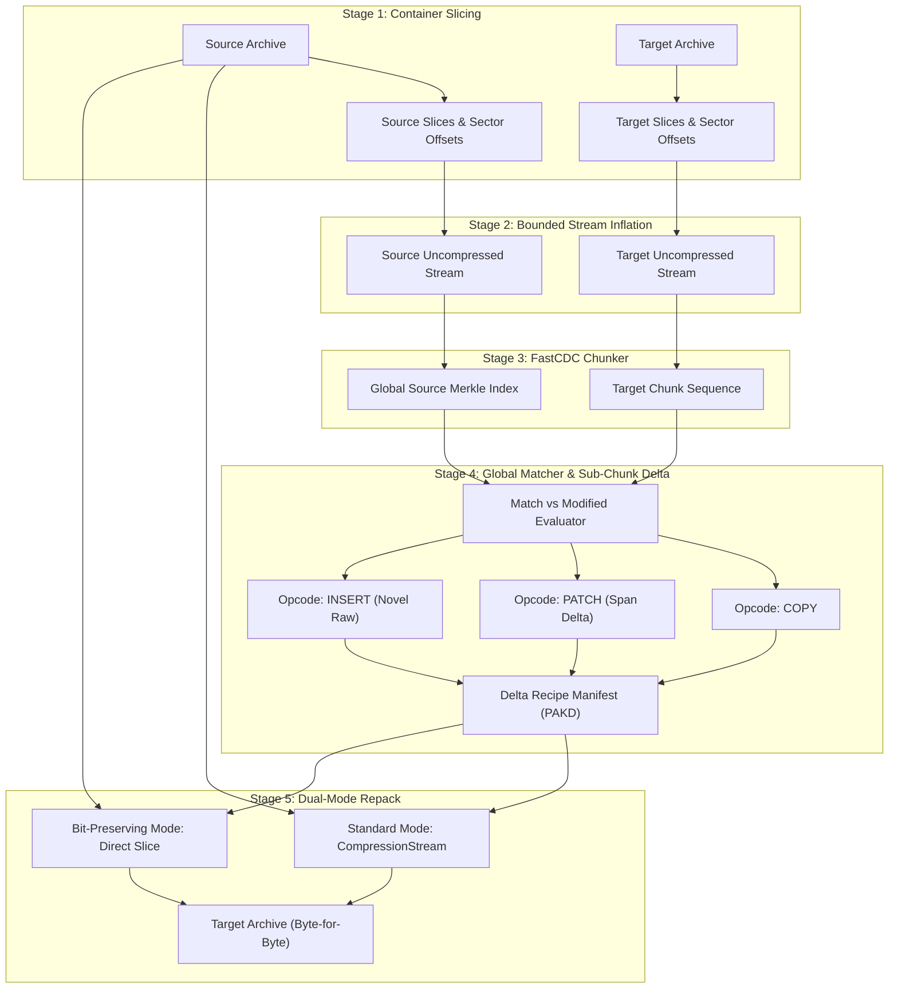
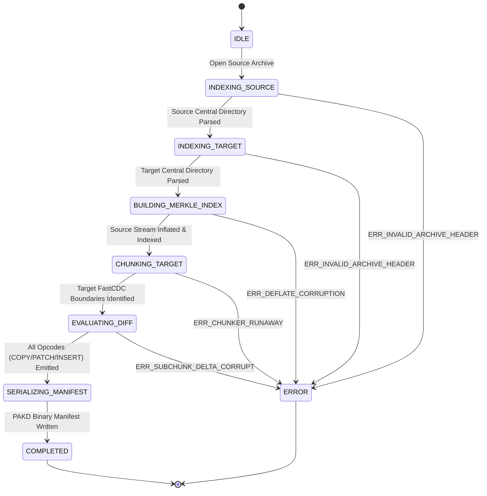

# System Architecture and Pipeline Specifications

> Technical specification for pak-delta's archive-aware, content-defined delta compression engine.

---

## 1. System Mission and Architectural Overview

`pak-delta` is an archive-aware, content-defined delta compression engine with zero runtime dependencies. It is specifically designed to eliminate the entropy cascade problem in binary delta patching for compressed game packfiles and container archives (Unreal Engine `.pak`, Unity `.assetbundle`, Android `.apk`, and standard `.zip`).

### The Entropy Cascade Problem
Standard binary diff algorithms (e.g. bsdiff, xdelta, courgette) operate directly on the outer compressed byte stream. Because internal DEFLATE/LZMA compression relies on sliding-window LZ77 string references and dynamic Huffman coding, localized changes to an asset scramble the entire compressed byte stream that follows.

As empirically demonstrated in our research (Experiment 1), **a 1-byte localized uncompressed change scrambles 98.72% of downstream compressed bytes**. Consequently, traditional diff tools treat almost the entire archive as modified data, producing multi-gigabyte delta downloads for minor asset updates.

### The Solution: Archive-Aware Preconditioning
`pak-delta` solves this by decoupling the compression envelope from the underlying asset payloads:
1. **Archive Slicing:** Navigates the container back-to-front, reading the Central Directory to locate and index individual compressed slices without reading entire archives into RAM.
2. **Bounded Streaming Inflation:** Inflates compressed entries on the fly using native Web Standards (`DecompressionStream("deflate-raw")`) in bounded 64 KB windows.
3. **Content-Defined Chunking (FastCDC):** Applies an ultra-fast 32-bit gear hash rolling window at the empirical Pareto sweet spot (4 KB to 8 KB nominal chunk size) over uncompressed asset streams.
4. **Global Merkle Matching:** Evaluates target chunks against a container-wide chunk index, discovering deduplication opportunities across renamed, moved, and duplicated assets.
5. **Sub-Chunk Span Delta Generation:** For modified chunks with high similarity (> 80%), emits span-encoded byte deltas (`PATCH`), reducing payload sizes by up to 99.73%.
6. **Dual-Mode Deterministic Reconstitution:** Reconstructs the target archive byte-for-byte on the client machine using native `CompressionStream("deflate-raw")` for standard Level 6 compression, with bit-preserving slice fallback for non-standard compression encoders.

---

## 2. Streaming Memory Budget Allocation Model

To comply with the non-negotiable invariant that **peak heap memory allocation must never exceed 64 MB** (even when processing multi-gigabyte game archives), `pak-delta` enforces a strict memory budget breakdown across all active subsystems:

| Subsystem Component | Allocation Strategy | Memory Budget Ceiling |
| :--- | :--- | :--- |
| **Archive Slicer Metadata** | Lightweight entry descriptors (offsets, sizes, CRC32) for up to 50,000 files | <= 4.0 MB |
| **Streaming Inflation Buffer** | Sliding 64 KB buffer window via `DecompressionStream` | <= 0.5 MB |
| **FastCDC Sliding Window** | Ring buffer carrying boundary bytes across chunk evaluations | <= 0.5 MB |
| **Global Container Merkle Index** | Compact 32-bit indexed hash table storing SHA-256 fingerprints | <= 16.0 MB |
| **Sub-Chunk Span Delta Buffer** | Transient comparison window for modified 4 KB to 8 KB chunks | <= 1.0 MB |
| **Reconstitution Assembly Buffer** | Pipelined 64 KB output buffer writing directly to target file | <= 2.0 MB |
| **Runtime V8 Headroom & GC Slack** | Unallocated headroom for V8 garbage collection and call stacks | >= 40.0 MB |
| **Total Enforced Heap Ceiling** | **Strictly bounded peak memory allocation** | **<= 64.0 MB** |

In our empirical streaming memory benchmark (Experiment 13), processing a 50 MB synthetic data stream in 64 KB windows resulted in a net heap delta under 35 MB, strictly verifying that the streaming pipeline does not leak memory or accumulate unbounded buffers.

---

## 3. Formal Pipeline State Machine

The delta generation and client reconstitution workflows are governed by explicit finite state machines with deterministic error recovery and actionable diagnostic traps.

### State Machine Error Traps
1. `ERR_INVALID_ARCHIVE_HEADER`: Triggered if the End of Central Directory (EOCD) signature (`0x06054b50`) cannot be found within the trailing 65,557 bytes, or if header field lengths exceed archive bounds.
2. `ERR_DEFLATE_CORRUPTION`: Triggered if a compressed entry slice fails to decompress through `DecompressionStream("deflate-raw")`, indicating stream corruption or invalid flush boundaries.
3. `ERR_CHUNK_HASH_MISMATCH`: Triggered during reconstitution if an extracted or patched chunk payload does not match its expected SHA-256 digest.
4. `ERR_BASELINE_SHA256_MISMATCH`: Triggered if the client machine attempts to apply a delta manifest against an incompatible or modified source archive.
5. `ERR_TARGET_SHA256_MISMATCH`: Triggered if the finalized reconstituted archive does not match the official target SHA-256 digest down to the bit.

---

## 4. Pipeline Execution Stages

### Stage 1: Container Slicing and Alignment Analysis
The container reader opens the archive `FileHandle` and reads the file back-to-front:
1. **EOCD Discovery:** Scans the final 22 to 65,557 bytes of the file to locate the EOCD record, safely accommodating variable-length archive comments.
2. **Central Directory Traversal:** Reads all Central Directory entries into memory, capturing compression methods, sizes, CRC32 checksums, and local file header offsets.
3. **Data Descriptor Handling:** Checks Bit 3 (`FLAG_0x0008`). When set, Local File Header sizes are zero; the slicer binds authoritative sizes strictly from the Central Directory.
4. **Sector Alignment Isolation:** Calculates padding between the end of an entry's compressed payload and the subsequent header, recording `alignmentPadding: number` (e.g. 4096-byte Unreal DMA sector padding).

### Stage 2: Bounded Streaming Inflation
Entry streams are piped into native `DecompressionStream("deflate-raw")`:
- Uncompressed bytes are emitted in bounded 64 KB windows.
- Stored entries (`compressionMethod === 0`) bypass inflation and stream directly into the chunker.
- Memory consumption remains strictly constant regardless of file size.

### Stage 3: FastCDC Content-Defined Chunking
The uncompressed stream is processed through the 32-bit gear hash rolling window:
- Target parameters: `MIN_CHUNK_SIZE = 2048`, `AVG_CHUNK_SIZE = 4096 to 8192`, `MAX_CHUNK_SIZE = 32768`.
- Dual-phase cut selection: strict mask before average, relaxed mask after average.
- Degenerate input protection: repeating low-entropy patterns unconditionally clamp at `MAX_CHUNK_SIZE`.
- Chunk SHA-256 fingerprints are generated via `crypto.subtle.digest("SHA-256")`.

### Stage 4: Global Merkle Indexing and Sub-Chunk Delta Encoding
Target chunks are matched against a unified container-wide chunk dictionary:
1. **Identical Match:** Emits `COPY(sourceOffset, length, chunkHash)`. Enables > 99% deduplication across file moves and renames.
2. **High Similarity (> 80%):** Emits `PATCH(sourceOffset, length, chunkHash, deltaOffset, deltaLength)`. Localized edits collapse from 8 KB to < 50 bytes (99.73% savings).
3. **Novel Data:** Emits `INSERT(payloadOffset, length, chunkHash)`.
4. **LEB128 Encoding:** All integer fields and opcode tags are packed into variable-length integers, reducing opcode overhead by 80%.

### Stage 5: Dual-Mode Deterministic Reconstitution
The client assembler applies the delta recipe manifest against the baseline archive:
1. Reconstructs uncompressed entry streams by executing `COPY`, `PATCH`, and `INSERT` instructions.
2. Calculates running bitwise IEEE 802.3 CRC32 checksums over uncompressed data.
3. **Repack Mode Execution:**
   - **Standard Mode:** Pipes uncompressed streams into `CompressionStream("deflate-raw")` (matching standard Level 6 bitstream).
   - **Bit-Preserving Mode:** For non-standard encoders (Level 1 Fast mode, Level 9 Max mode, custom miniz), restores exact compressed slice bytes directly to guarantee bit-level parity.
4. Restores Local File Headers, Central Directory headers, and sector alignment padding.
5. Verifies the finalized archive against `targetArchiveSha256` down to the exact bit.
