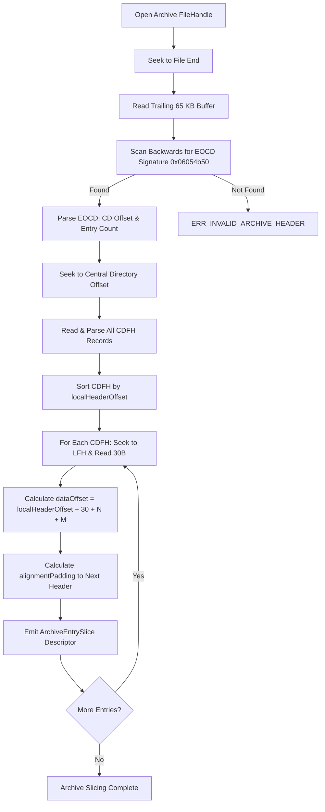

# Archive Formats, Container Slicing, and Inflation

> Technical specification for container layouts (ZIP, PAK, APK), back-to-front slicing, streaming data descriptors, and DMA sector alignment.

---

## 1. Binary Container Structures and Layouts

Game archives such as Unreal Engine `.pak` files, Unity `.assetbundle` files, Android `.apk` packages, and standard `.zip` archives bundle collections of asset files inside indexed binary envelopes.

Understanding the precise physical byte layout is critical to extracting uncompressed asset payloads without falling victim to the entropy cascade.

### Physical Container Byte Stream
The archive container is arranged in three distinct regions:

```text
+-------------------------------------------------------------------------+
| Local File Record 1: [LFH (30B + N + M)] [Payload 1] [Alignment Padding]|
+-------------------------------------------------------------------------+
| Local File Record 2: [LFH (30B + N + M)] [Payload 2] [Alignment Padding]|
+-------------------------------------------------------------------------+
| ...                                                                     |
+-------------------------------------------------------------------------+
| Central Directory Record 1: [CDFH (46B + N + M + K)]                   |
+-------------------------------------------------------------------------+
| Central Directory Record 2: [CDFH (46B + N + M + K)]                   |
+-------------------------------------------------------------------------+
| End of Central Directory Record: [EOCD (22B + C)]                       |
+-------------------------------------------------------------------------+
```

---

## 2. Low-Level Binary Header Specifications

### 2.1 End of Central Directory (EOCD) Record
The EOCD record is located at the very end of the archive and acts as the bootstrap entry point:

| Offset | Field | Length | Value / Description |
| :--- | :--- | :--- | :--- |
| 0 | Signature | 4 bytes | `0x06054b50` (`PK\x05\x06` Little-Endian) |
| 4 | Disk Number | 2 bytes | Number of this disk (`0x0000`) |
| 6 | Central Directory Disk | 2 bytes | Disk where Central Directory starts |
| 8 | Total Entries on Disk | 2 bytes | Number of CD records on this disk |
| 10 | Total Entries | 2 bytes | Total number of CD records |
| 12 | Central Directory Size | 4 bytes | Byte length of the entire Central Directory |
| 16 | Central Directory Offset | 4 bytes | Offset of start of Central Directory relative to archive start |
| 20 | Archive Comment Length | 2 bytes | Length of variable comment $C$ (0 to 65,535 bytes) |
| 22 | Archive Comment | $C$ bytes | Optional trailing comment bytes |

#### Back-to-Front Search Algorithm
Because an archive may contain an arbitrary comment up to 65,535 bytes, the slicer cannot assume the EOCD starts at `fileSize - 22`.
1. The slicer calculates `searchWindow = Math.min(fileSize, 65535 + 22)`.
2. Reads the final `searchWindow` bytes into a buffer.
3. Scans backwards from `buffer.length - 22` down to 0, looking for the 4-byte signature `0x06054b50`.
4. Validates that `commentLength === buffer.length - (matchOffset + 22)`.

### 2.2 Central Directory File Header (CDFH)
Each asset in the container has a 46-byte fixed header in the Central Directory:

| Offset | Field | Length | Value / Description |
| :--- | :--- | :--- | :--- |
| 0 | Signature | 4 bytes | `0x02014b50` (`PK\x01\x02`) |
| 4 | Version Made By | 2 bytes | Host OS and ZIP specification version |
| 6 | Version Needed | 2 bytes | Minimum version to extract (e.g. 20 for Deflate) |
| 8 | Bit Flag | 2 bytes | General purpose bit flag (Bit 3: Data Descriptor) |
| 10 | Compression Method | 2 bytes | `0 = STORED`, `8 = DEFLATED` |
| 12 | Last Mod Time | 2 bytes | MS-DOS timestamp |
| 14 | Last Mod Date | 2 bytes | MS-DOS date |
| 16 | CRC32 | 4 bytes | IEEE 802.3 uncompressed checksum |
| 20 | Compressed Size | 4 bytes | Compressed payload length in bytes |
| 24 | Uncompressed Size | 4 bytes | Uncompressed payload length in bytes |
| 28 | Filename Length ($N$) | 2 bytes | Length of filename string |
| 30 | Extra Field Length ($M$) | 2 bytes | Length of extra metadata field |
| 32 | Comment Length ($K$) | 2 bytes | Length of file comment |
| 34 | Disk Number Start | 2 bytes | Disk where file starts |
| 36 | Internal Attributes | 2 bytes | File attributes |
| 38 | External Attributes | 4 bytes | OS-specific permissions (POSIX / Windows) |
| 42 | Local Header Offset | 4 bytes | Byte offset of Local File Header from start of archive |
| 46 | Variable Fields | $N+M+K$ | Filename, Extra Field, Comment |

### 2.3 Local File Header (LFH)
Preceding each compressed payload is the 30-byte Local File Header:

| Offset | Field | Length | Description |
| :--- | :--- | :--- | :--- |
| 0 | Signature | 4 bytes | `0x04034b50` (`PK\x03\x04`) |
| 4 | Version Needed | 2 bytes | Minimum version to extract |
| 6 | Bit Flag | 2 bytes | General purpose bit flag |
| 8 | Compression Method | 2 bytes | `0 = STORED`, `8 = DEFLATED` |
| 10 | Last Mod Time / Date | 4 bytes | Timestamps |
| 14 | CRC32 | 4 bytes | Uncompressed CRC32 (or 0 if Bit 3 set) |
| 18 | Compressed Size | 4 bytes | Compressed size (or 0 if Bit 3 set) |
| 22 | Uncompressed Size | 4 bytes | Uncompressed size (or 0 if Bit 3 set) |
| 26 | Filename Length ($N$) | 2 bytes | Length of filename |
| 28 | Extra Field Length ($M$) | 2 bytes | Length of extra field |
| 30 | Variable Fields | $N+M$ | Filename, Extra Field |
| $30+N+M$ | **Payload Bytes** | Variable | Raw compressed or stored payload |

#### Payload Offset Formula
The payload data start offset is strictly calculated as:
$$\text{dataOffset} = \text{localHeaderOffset} + 30 + N + M$$

---

## 3. Critical Edge Cases and Mitigation

### Edge Case 1: Streaming ZIP Data Descriptors (`FLAG_0x0008`)
When tools (e.g. UnrealPak streaming output, `zip -`) write archives to pipes or sockets, they cannot seek backward to update sizes in the Local File Header:
- General Purpose Bit Flag Bit 3 (`0x0008`) is set.
- In the Local File Header: CRC32, Compressed Size, and Uncompressed Size are set to zero.
- The compressed stream is terminated by a Data Descriptor:
  - Format A (16 bytes): Signature `0x08074b50` (4B), CRC32 (4B), Compressed Size (4B), Uncompressed Size (4B).
  - Format B (12 bytes): CRC32 (4B), Compressed Size (4B), Uncompressed Size (4B) (signature omitted).

**Mandatory Slicer Invariant:** Forward linear slicing from Local File Headers is strictly forbidden. The slicer navigates back-to-front: the Central Directory contains the authoritative non-zero sizes and offsets for all entries.

### Edge Case 2: Unreal Engine DMA Sector Alignment Padding
Unreal Engine `.pak` files align file payloads to 4,096-byte (or 64 KB) sector boundaries to facilitate Direct Memory Access (DMA) streaming directly from NVMe SSDs to GPU memory:
- If an entry ends at offset 5,200, the packaging tool injects 2,992 zero-bytes to align the next Local File Header to offset 8,192 ($2 \times 4096$).
- If padding bytes are treated as file contents, chunk boundaries misalign and delta compression ratios collapse.

**Slicer Strategy:**
1. The slicer sorts Central Directory entries by `localHeaderOffset`.
2. For each entry $i$:
   $$\text{entryEndOffset} = \text{dataOffset}_i + \text{compressedSize}_i + (\text{hasDataDescriptor}_i ? 16 : 0)$$
3. If entry $i+1$ exists:
   $$\text{alignmentPadding}_i = \text{localHeaderOffset}_{i+1} - \text{entryEndOffset}$$
   If entry $i$ is the last entry before the Central Directory:
   $$\text{alignmentPadding}_i = \text{centralDirectoryOffset} - \text{entryEndOffset}$$
4. The padding length is isolated and recorded in the slice descriptor.
5. During reconstitution, the assembler emits exact zero-padding bytes, preserving 100% sector alignment.

### Edge Case 3: ZIP64 Extensions (Files > 4 GB)
For containers exceeding 4 GB or 65,535 entries:
- Standard 32-bit fields in CDFH or EOCD are set to `0xFFFFFFFF` (or `0xFFFF`).
- The slicer parses the ZIP64 Extended Information Extra Field (`Header ID: 0x0001`):
  - 8-byte Uncompressed Size
  - 8-byte Compressed Size
  - 8-byte Local Header Relative Offset
- The Zip64 End of Central Directory locator (`0x07064b50`) precedes the standard EOCD.

---

## 4. Back-to-Front Slicing State Machine



---

## 5. Domain Type Specifications

```typescript
export interface ArchiveEntrySlice {
  index: number;
  filename: string;
  compressionMethod: number; // 0 = STORED, 8 = DEFLATE
  localHeaderOffset: number;
  dataOffset: number;
  compressedSize: number;
  uncompressedSize: number;
  crc32: number;
  extraFieldLength: number;
  alignmentPadding: number;
  hasDataDescriptor: boolean;
}

export interface ContainerIndex {
  archiveSha256: string;
  totalEntries: number;
  centralDirectoryOffset: number;
  centralDirectorySize: number;
  slices: ArchiveEntrySlice[];
}
```
