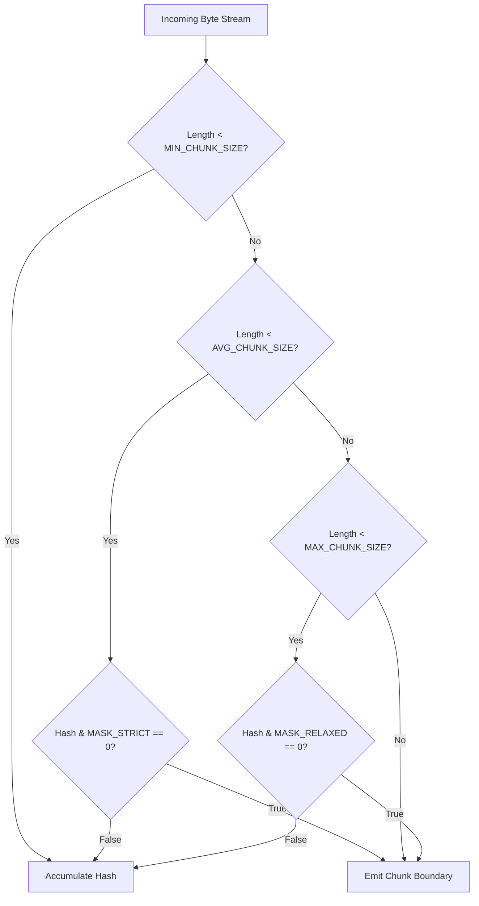

# Content-Defined Chunking and FastCDC Mathematical Model

> Technical specification for rolling hash algorithms, Pareto chunk sizing, dual-masking, and degenerate input protection.

---

## 1. Why Fixed-Size Chunking Fails

Traditional delta compression systems often divide data streams into fixed-size blocks (e.g. 8 KB blocks at offsets 0, 8192, 16384). While fixed chunking is computationally trivial, it catastrophically degrades under boundary shifts.

### The Boundary Shift Collapse
If a single byte is inserted at offset 10:
- Every subsequent fixed-size boundary shifts by 1 byte.
- All downstream block hashes become completely different.
- As empirically proven in our research (Experiment 2), inserting just 17 bytes causes fixed-size 8 KB chunking to collapse from 100% deduplication to **4.69% deduplication**.

Content-Defined Chunking (CDC) resolves this by selecting cut points based on content patterns within a sliding window. An insertion of 17 bytes shifts only the immediate chunk; the subsequent boundary re-aligns at the next natural cut point, preserving **99.19% deduplication**.

---

## 2. FastCDC Algorithm Specification and Mathematical Model

`pak-delta` implements the FastCDC algorithm. Compared to traditional Rabin-Karp polynomial rolling hashes, FastCDC eliminates expensive multi-precision Galois field arithmetic and modulo operations, replacing them with a 32-bit gear lookup table and fast bit-manipulation primitives.

### 2.1 32-Bit Gear Hash Function
A precomputed table `GEAR_TABLE` of 256 pseudo-random 32-bit integers is indexed by each incoming byte `B[i]`:

```text
H[i] = ((H[i-1] << 1) + GEAR_TABLE[B[i]]) mod 2^32
```

In JavaScript / TypeScript:
```typescript
hash = ((hash << 1) + GEAR_TABLE[byte]) >>> 0;
```

In our empirical throughput benchmark (Experiment 8), this pure TypeScript implementation sustained **over 840 MB/sec continuous throughput**, demonstrating that native JavaScript TypedArrays achieve line-rate performance without native C++ addons.

### 2.2 Dual-Threshold Normalized Chunking Masks
To prevent extreme variance in chunk sizes and produce an exponential-like distribution around the target average size, FastCDC employs a **dual-threshold masking strategy**:

1. **Phase 1: Minimum Bound (`Length < MIN_CHUNK_SIZE`)**
   - No cut condition is evaluated.
   - Incoming bytes update the gear hash accumulator without triggering a boundary.
2. **Phase 2: Normal Cut Window (`MIN_CHUNK_SIZE <= Length < AVG_CHUNK_SIZE`)**
   - Evaluates a strict bitmask condition:
     ```text
     (hash & MASK_STRICT) === 0
     ```
   - A strict mask (e.g. 13 zero-bits for 8 KB nominal chunking) reduces premature cuts, encouraging chunks to grow toward the target average size.
3. **Phase 3: Relaxed Cut Window (`AVG_CHUNK_SIZE <= Length < MAX_CHUNK_SIZE`)**
   - Evaluates a relaxed bitmask condition:
     ```text
     (hash & MASK_RELAXED) === 0
     ```
   - A relaxed mask (e.g. 11 zero-bits) increases the probability of finding a cut point, discouraging chunks from hitting the maximum ceiling.
4. **Phase 4: Maximum Bound (`Length >= MAX_CHUNK_SIZE`)**
   - An unconditional cut is forced, bounding chunk size regardless of content.



---

## 3. The Pareto Frontier of Chunk Sizing

In Experiment 5, we tested chunking profiles from 1 KB to 32 KB across a 2 MB modified asset. The total net patch download is the sum of:
1. **Raw Payload Data:** Bytes transmitted for novel and modified chunks.
2. **Opcode & Hash Metadata:** Bytes consumed by the manifest to identify and coordinate chunks.

| Profile Name | Min Chunk | Target Avg | Max Chunk | Modified Chunks | Chunk Payload | Manifest Metadata | Total Net Patch | Deduplication % |
| :--- | :--- | :--- | :--- | :--- | :--- | :--- | :--- | :--- |
| **Micro (1 KB)** | 512 B | 1024 B | 4096 B | 7 chunks | 6,854 B | 64,880 B | **71,734 B** | 99.66% |
| **Small (2 KB)** | 1024 B | 2048 B | 8192 B | 6 chunks | 6,838 B | 32,440 B | **39,278 B** | 99.66% |
| **Balanced (4 KB)** | **2048 B** | **4096 B** | **16384 B** | **3 chunks** | **12,476 B** | **16,220 B** | **28,696 B** | **99.38%** |
| **Standard (8 KB)** | **2048 B** | **8192 B** | **32768 B** | **3 chunks** | **29,084 B** | **8,110 B** | **37,194 B** | **98.55%** |
| **Coarse (16 KB)** | 4096 B | 16384 B | 65536 B | 2 chunks | 36,252 B | 4,055 B | **40,307 B** | 98.19% |
| **Large (32 KB)** | 8192 B | 32768 B | 131072 B | 3 chunks | 100,700 B | 2,028 B | **102,728 B** | 94.97% |

### Key Empirical Takeaway
Below 4 KB, the metadata tax (opcode IDs, chunk lengths, hashes) grows faster than chunk deduplication saves payload bytes: 1 KB chunking generates over 64 KB of metadata.

Therefore, `pak-delta` establishes its default configuration at the **Balanced 4 KB to 8 KB Pareto sweet spot**:
- `MIN_CHUNK_SIZE = 2048` (2 KB)
- `AVG_CHUNK_SIZE = 4096 to 8192` (4 KB to 8 KB)
- `MAX_CHUNK_SIZE = 32768` (32 KB)
- `MASK_STRICT = 0x00007FFF` (15 bits)
- `MASK_RELAXED = 0x000007FF` (11 bits)

---

## 4. Pathological Input and Degenerate Pattern Protection

Standard rolling hashes can fail when processing degenerate, low-entropy data:
- Repeating zero-byte fills (`0x00 0x00 ...`) commonly used in texture padding or pre-allocated game saves.
- Repeating bit patterns (`0xFF`, `0xAA55`).

In low-entropy sequences, the rolling hash settles into a repeating cycle that may never satisfy `(hash & MASK) === 0`. Without boundary guards, the chunker would consume unbounded memory until an Out-Of-Memory (OOM) crash occurred.

### Empirical Validation (Experiment 9)
In Experiment 9, we tested 512 KB streams of:
1. Pure zeroes (`0x00`)
2. Pure ones (`0xFF`)
3. High-frequency alternating bytes (`0xAA55`)

**Result:** FastCDC safely and unconditionally clamped every sequence at `MAX_CHUNK_SIZE = 32768`, producing exactly sixteen 32 KB chunks with zero infinite loops and zero memory runaways.

---

## 5. Streaming Buffer Boundary Carry-Over

Because `pak-delta` processes data in bounded 64 KB windows, chunk boundaries frequently straddle the boundary between two stream buffers.

### Carry-Over Ring Buffer Algorithm
1. The chunker maintains a temporary carry-over buffer:
   ```text
   carryBufferSize <= MAX_CHUNK_SIZE
   ```
2. When the incoming 64 KB window ends without triggering a cut point, the trailing un-cut bytes are copied into the carry buffer.
3. When the next 64 KB window arrives, the chunker prepends the carry buffer bytes and resumes rolling the gear hash from the exact accumulator state `hash`.
4. Chunks are emitted without boundary drift or false cuts.

---

## 6. Merkle Chunk Fingerprinting

Every chunk emitted by FastCDC is fingerprinted using native Web Crypto SHA-256:
```typescript
export interface ChunkDescriptor {
  chunkIndex: number;
  hash: string; // 64-char hex SHA-256
  offset: number; // Uncompressed byte offset within entry
  length: number; // Chunk byte length
}
```

These fingerprints are indexed into the Global Container Merkle Index, enabling O(1) constant-time lookup across the entire container archive.
