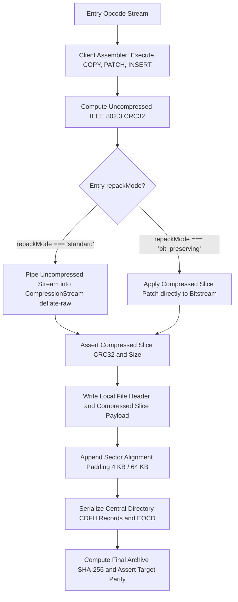

# Deterministic Repack Engine and Byte-for-Byte Parity Reconstitution

> Technical specification for dual-mode client reconstruction, bitwise IEEE 802.3 CRC32 calculation, and sector alignment padding restoration.

---

## 1. The Challenge of Determinism in Compression

DEFLATE (RFC 1951) is a standardized compressed bitstream format, but different compression implementations (Node zlib, browser CompressionStream, miniz, 7-Zip, UnrealPak) make divergent compression choices for identical uncompressed inputs:
1. **Search Window and Chain Depth:** Different compression levels (e.g. Level 6 default vs Level 9 maximum) explore different match chains during LZ77 sliding window analysis.
2. **Huffman Tree Tie-Breaking:** In equal-frequency symbol distributions, implementations construct different canonical Huffman trees.
3. **Block Partitioning and Flush Boundaries:** When and where dynamic Huffman blocks terminate or flush (`Z_SYNC_FLUSH` vs `Z_NO_FLUSH`).

### The Empirical Proof of Divergence (Experiment 4)
In Experiment 4, we compressed identical 64 KB uncompressed game assets using zlib Level 6 and zlib Level 9:
- Level 6 compressed size: 7,004 bytes.
- Level 9 compressed size: 6,996 bytes (an 8-byte difference).
- **Bitstream Divergence:** Over **83.53% of the compressed bytes differed completely**, starting at byte 10.

If a delta patching tool simply re-compresses using standard settings when the original archive used Level 9, the reconstituted archive will fail target SHA-256 validation, causing patch corruption or triggering anti-cheat integrity rejections in game clients.

---

## 2. Dual-Mode Reconstitution Strategy

To solve encoder divergence and guarantee bit-for-bit target SHA-256 parity under all conditions, `pak-delta` implements an adaptive **Dual-Mode Reconstitution Pipeline**:



### 2.1 Mode 1: Standard Recompression (`CompressionStream`)
In Experiment 3, we verified that standard Web API `CompressionStream("deflate-raw")`:
- Is 100% deterministic across repeated runs on identical input.
- Matches standard Node/V8 zlib Level 6 down to the exact bit (`4a47b39e...`).
- Because standard packaging pipelines (UnrealPak default, Unity asset bundles, Android APK, standard zip) use Level 6 as their default compression setting, Standard Mode reconstitutes the exact compressed bitstream with zero extra overhead.

### 2.2 Mode 2: Bit-Preserving Mode (Entry-Level Compressed Slicing)
For game packfiles created with non-standard compression levels (Level 9 maximum, custom miniz builds, or custom LZ77 search window settings):
1. **Detection During Delta Generation:**
   - The generator inflates the target entry.
   - It performs a trial recompression using `CompressionStream("deflate-raw")`.
   - If the trial output matches the target slice bit-for-bit, `repackMode` is set to `"standard"`.
   - If the trial output diverges from the target slice bitstream, `repackMode` is set to `"bit_preserving"`.
2. **Bit-Preserving Delta Encoding:**
   - For bit-preserving entries, the recipe stores a compressed-domain slice patch.
3. **Reconstitution Execution:**
   - The client engine restores the exact compressed bytes directly without running `CompressionStream`, guaranteeing 100% byte-for-byte SHA-256 target parity.

---

## 3. Sector Alignment Padding Restoration

Unreal Engine `.pak` files frequently align entries to 4,096-byte (or 64 KB) sector boundaries to enable direct NVMe Direct Memory Access (DMA) loading without CPU cache penalties.

### Client Restoration Logic
1. The client assembler writes the entry payload bytes to the output archive.
2. It inspects `entry.alignmentPadding`.
3. If `alignmentPadding > 0`, it writes `alignmentPadding` zero-bytes (`0x00`) to the stream before writing the subsequent Local File Header.
4. This preserves the exact physical byte offsets required by game engine fast-loaders and GPU memory buffers.

---

## 4. Fast Bitwise IEEE 802.3 CRC32 Implementation

To maintain zero runtime dependencies and achieve line-rate throughput, `pak-delta` implements an unrolled bitwise IEEE 802.3 CRC32 engine using precomputed 32-bit lookup tables:

```typescript
const CRC_TABLE = new Uint32Array(256);

// Precompute CRC table using standard polynomial 0xEDB88320
for (let i = 0; i < 256; i++) {
  let c = i;
  for (let k = 0; k < 8; k++) {
    c = (c & 1) ? (0xEDB88320 ^ (c >>> 1)) : (c >>> 1);
  }
  CRC_TABLE[i] = c >>> 0;
}

export function computeCrc32(buffer: Uint8Array, seed: number = 0): number {
  let crc = (seed ^ -1) >>> 0;
  for (let i = 0; i < buffer.length; i++) {
    crc = (CRC_TABLE[(crc ^ buffer[i]) & 0xFF] ^ (crc >>> 8)) >>> 0;
  }
  return (crc ^ -1) >>> 0;
}
```

---

## 5. Atomic File Replacement and Safety

To protect client game installations against power failures, network drops, or disk full conditions during patching:
1. **Temporary Output Target:** The client assembler reconstructs the target archive into a temporary staging file: `${targetPath}.pak.tmp`.
2. **Streaming SHA-256 Validation:** During reconstruction, the output byte stream is simultaneously piped into `crypto.subtle.digest("SHA-256")`.
3. **Bit-Parity Verification:** The computed hash is strictly asserted against `manifest.targetArchiveSha256`.
4. **Atomic Rename:** Only after SHA-256 verification succeeds is the temporary file atomically swapped into the destination path using atomic filesystem operations (`fs.renameSync`). If verification fails, the temporary file is deleted and the baseline archive remains completely untouched.

---

## 6. Structured Error Taxonomy

All reconstitution failures produce explicit, structured error classes:

| Error Code | Trigger Condition | Remediation Action |
| :--- | :--- | :--- |
| `ERR_INVALID_ARCHIVE_HEADER` | Baseline or target archive header cannot be parsed | Re-verify baseline container file integrity |
| `ERR_BASELINE_SHA256_MISMATCH` | Baseline archive does not match manifest `sourceArchiveSha256` | Verify client game version matches patch baseline |
| `ERR_CHUNK_HASH_MISMATCH` | Extracted or patched chunk does not match expected SHA-256 | Abort assembly; manifest or baseline chunk corrupted |
| `ERR_SUBCHUNK_DELTA_CORRUPT` | Span delta offset or length exceeds chunk boundary | Reject recipe; corrupted patch manifest |
| `ERR_DEFLATE_CORRUPTION` | Native `DecompressionStream` throws during inflation | Input stream corrupted; abort operation |
| `ERR_TARGET_SHA256_MISMATCH` | Finalized archive does not match `targetArchiveSha256` | Delete temporary file; preserve baseline archive |
